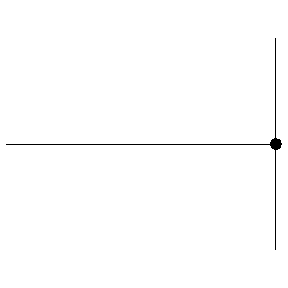
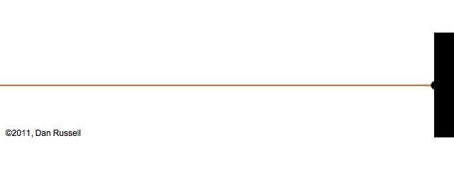
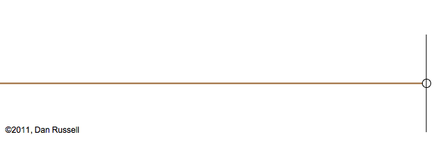
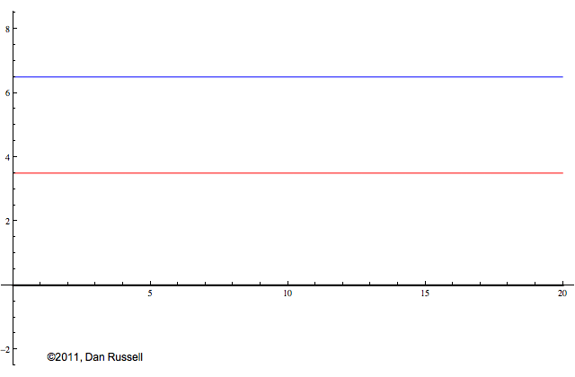
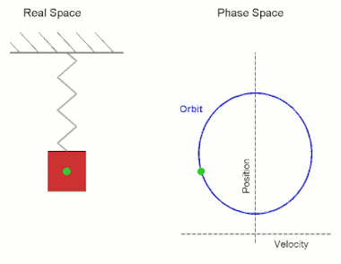
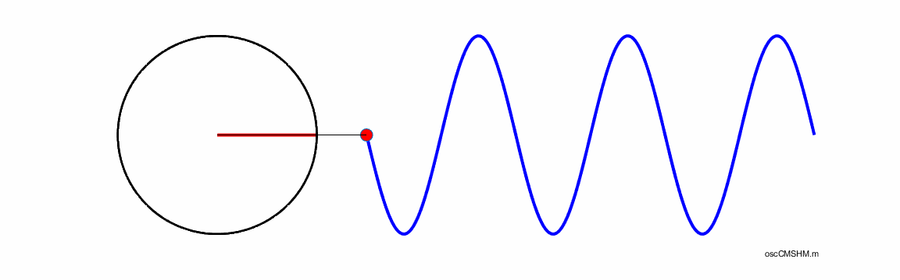

# Vlnová podstata zvuku

**Zvuk** = slyšitelné akustické vlnění.[^1][^2]

[^1]: https://cs.wikipedia.org/wiki/Zvuk
[^2]: https://en.wikipedia.org/wiki/Sound

- _slyšitelné_ = vyvolává sluchový _vjem_ (sensation), _vnímáno_ lidským uchem
- _akustické_ = ἀκουστῐκός, slyšitelné (zde: pleonasmus)
- _vlnění_ = (periodické) kmitání šířící se hmotným prostředím (médiem)
- _médium_ - plyn, kapalina, pevná látka, ❌vakuum

slova týkající se zvuku: audio- (lat. slyšet), sono- (lat. zvuk), fono- (řec. zvuk)

## Vlnění, vlny

[^3]

[^3]: https://artpictures.club/autumn-2023.html

 

### Veličiny popisující vlnění

- _frekvence_, _kmitočet_ ~ „výška“ zvuku, ca. 16Hz-20kHz (Hertz, cps - _cyklů_ za sekundu) \
  infrazvuk < 16Hz (slon), 20kHz < ultrazvuk (pes, netopýr)
- _amplituda_, _rozkmit_ ~ hlasitost zvuku
- _rychlost šíření_ ~ „rychlost zvuku“ (v daném prostředí)
- _rychlost šíření_ / _kmitočet_ = vlnová délka
- _fáze_ - posun v čase, sama o sobě není slyšitelná

## Druhy vlnění[^4]

[^4]: https://www.acs.psu.edu/drussell/demos.html

- postupné (travelling wave) - šířící se určitým směrem \
   stojaté (standing wave) - interference (superpozice) postupného vlnění \
  

- příčné (transverse) (v pevném prostředí)\
  

- podélné (longitudinal) (v plynech a kapalinách) \
  

## Přenos zvuku prostředím

Zdroj zvuku (vlnění, kmitání, vibrace, chvění), energie \
➜ propagace (šíření, přenos) elastickými silami od částice k částici v prostředí \
➜ stimulace sluchového nervu \
➜ vjem (pocit) zvuku.

✅ vlnění se šíří (postupuje, propaguje) prostředím \
❌ částice prostředí přitom více-méně zůstávají na místě, jen se vychylují.

### Další příklady

Radiální podélné vlnění (stlačování a zřeďování prostředí)

Podélné vlnění, detail

Povrch vody, kombinace podélného a příčného vlnění

<!--  -->
<!--  -->
<!--  -->
<!--  -->
<!--  -->
<!--  -->
<!--  -->
<!--  -->
<!--  -->
<!--  -->

## ➜ Kruhový a harmonický pohyb  (circular motion, simple harmonic motion)

harmonický oscilátor, fázový prostor[^5]

[^5]: https://en.wikipedia.org/wiki/Simple_harmonic_motion
[^6]: https://d-arora.github.io/VisualPhysics

vztah mezi kruhovým a harmonickým pohybem[^6]

➜ nejjednodušší periodické vlnění = _**sinusová vlna**_ (sine wave, sinusoid)
