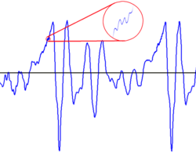
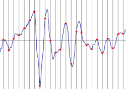
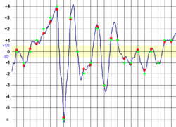
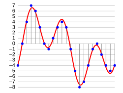
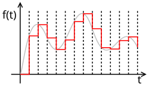
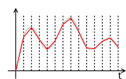

# Analogový a digitální zvuk

## Analogový zvukový záznam (analogue sound recording)

- spojitý záznam zvukové vlny pomocí odpovídajícím způsobem se měnící (analogické, úměrné) jiné fyzikální veličiny

Edisonův fonograf (1877)

 

## Digitální zvukový záznam (digital sound recording)

Záznam

- měříme amplitudu spojité vlny v pravidelných časových intervalech (vzorkování, sampling)
- každé měření zaokrouhlíme na nejbližší hodnotu digitálně reprezentovatelnou (kvantizace)
- výsledkem je posloupnost čísel (vzorků)

Reprodukce

- z naměřených hodnot rekonstruujeme spojitou vlnu (interpolace)
- přehráváme rekonstruovanou vlnu

## A/D a D/A konverze (ADC, DAC)[^1][^2][^3][^4]

[^1]: https://cs.wikipedia.org/wiki/A/D_p%C5%99evodn%C3%ADk
[^2]: https://en.wikipedia.org/wiki/Analog-to-digital_converter
[^3]: https://cs.wikipedia.org/wiki/D/A_p%C5%99evodn%C3%ADk
[^4]: https://en.wikipedia.org/wiki/Digital-to-analog_converter

- analogový signál (spojitý v čase i hodnotách)

- vzorkování (sampling) - měření v pravidelných intervalech

- kvantizace (zaokrouhlování na diskrétní hodnoty)

## Rozlišení ADC

- počet vzorků za sekundu (sampling rate, sample rate, **sr**)
- počet bitů na vzorek (bit depth **n**) ➜ počet kvantizačních úrovní = 2n

Důsledky:

- **sr** omezuje maximální frekvenci (kmitočet) zvuku (Nyquistova frekvence sr/2)\
   \
  před vzorkováním je nutné zařadit dolní propust (low-pass anti-aliasing filter)
- **n** omezuje dynamický rozsah, nízké **n** způsobí kvantizační šum \
  

## DAC

- vzorkovaný digitální signál (diskrétní v čase i hodnotách)

- výstupní signál (zero-order hold)

- výstupní signál (first-order hold)

- ➜ vyhlazení (reconstruction filter, low-pass filter)

## Běžné formáty digitálního zvuku

| Formát   | sampling rate                 | bit depth        |
| -------- | ----------------------------- | ---------------- |
| CD       | 44.1 kHz                      | 16 b             |
| DVD      | 48 kHz                        | 24 b             |
| WAV etc. | 44.1 kHz, 48 kHz, 96 kHz, ... | 16 b, 24 b, 32 b |

## Subnormální čísla (denorms, subnormals)

Při zpracování zvuku se dnes typicky používají čísla s plovoucí desetinnou čárkou, IEEE 754.

Subnormální čísla (denorms) mají nejnižší exponenta mantisu s vedoucími nulami. Reprezentují čísla velmi blízká nule, za cenu výrazně pomalejších výpočtů na některých (starších) CPU. Při zpracování zvuku nejsou podstatná, proto se často např. nahrazují nulou (flush to zero). Závisí na CPU.
