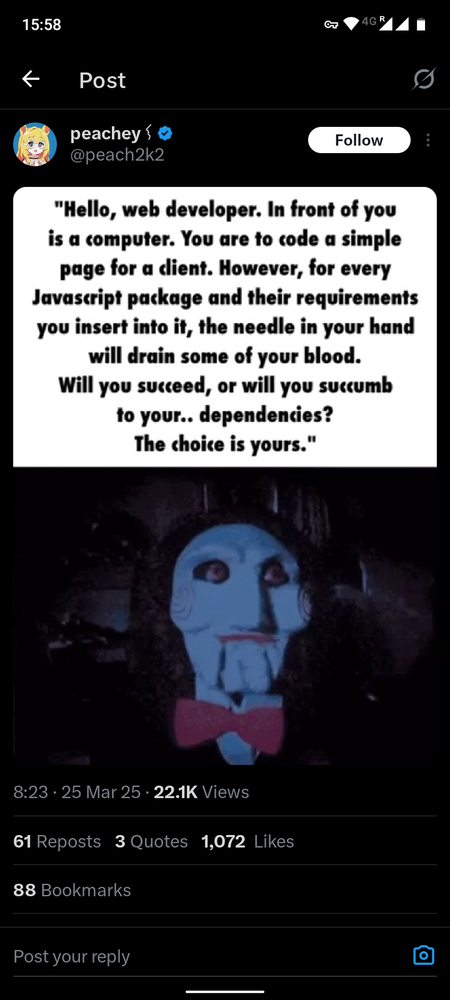
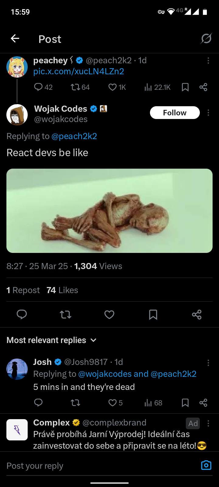

# Semestrální (zápočtový) projekt

Vytvořte _jednoduchou_ (v omezeném rozsahu) full-stack (odzadu – dopředu) webovou aplikaci,
která bude zpracovávat (ukládat, číst, filtrovat) a zobrazovat data podle vašeho výběru.

Námět si zvolte svobodně. Mohou to být například: knihy v knihovně, filmy v kinech, studenti
ve škole, jídla v restauraci, recepty na vaření, země na světě, piva v pivovarech, ...

Samozřejmě si můžete námět zvolit tak, aby měl souvislost s vaší prací v jiných předmětech.

Data budou uložena v databázi, případně také na disku v XML souborech.

Webová aplikace se bude skládat z několik (4+) stránek. Alespoň jedna stránka bude obsahovat
HTML formulář pro vkládání dat, zadávání filtrů nebo požadavků a tak podobně.

Na stránkách aplikace vhodným způsobem zobrazena data z databáze, z XML souborů, apod.

**Cílem není**:

- rozsáhlý, složitý projekt

**Cílem je**:

- projekt, ve kterém si _v rozumném rozsahu_ vyzkoušíte dané technologie
- projekt, který obsahuje kód, kterému dobře rozumíte (pozor na generovaný kód, tomu musíte
  porozumět a v každém případě byste jej vždy měli revidovat, zbavit nepotřebných částí, a
  vhodně upravit)
- projekt, který je dobře organizovaný, přehledný, snadno čitelný a pochopitelný a, pokud
  možno, minimalistický (nejsou v něm zbytečnosti)
- kód, který je psaný podle zásad dobrého programování (KISS, DRY, YAGNI)

## Použité technologie:

V projektu použijte následující technologie:

- Server (backend): Docker/Linux/Apache:

  - Databáze: např. PostgreSQL, MySQL, MariaDB, SQLite, nebo jiná (také NoSQL)
  - PHP
  - XML + zpracování XML (XML DOM) pomocí PHP

- Klient (frontend): prohlížeč

  - HTML5/XML, CSS, JS
  - manipulace HTML(XML) DOM pomocí JS
  - volitelně: AJAX (fetch API)

**Q**: proč vanilla?

**A**:

  
  
  
  

## Jak na to:

- Data

  - navrhněte strukturu XML souborů, XSD pro jejich validaci, XSL pro transformaci na HTML

  - XML použijte pro přenos dat mezi klientem a serverem, pro zobrazování dat, případně pro
    ukládání dat

- Server:

  - navrhněte a vytvořte potřebné databázové tabulky, vložte/importujte do nich potřebná
    (počáteční) data
  - případně vytvořte XML soubory s daty
  - vytvořte PHP skripty pro generování HTML/XML stránek, pro zpracování požadavků z klienta
    a pro čtení a zápis dat
  - do stránek přidejte JS, který se bude provádět na straně klienta
  - stránky _jednoduše_ (pokud možno elegentně) ostylujte pomocí CSS

- Klient:

  - prohlížeč zobrazuje HTML a/nebo XML generované serverem a provádí v něm obsažené JS
    skripty

- JavaScript (JS):

  - obsluhuje v prohlížeči události (events – uživatelské interakce, časovač, ...)
  - manipuluje HTML DOM a případně také XML DOM
  - případně také realizuje jednoduchou reaktivitu (událost → JS obsluha → manipulace DOM →
    změna zobrazení)

- Komunikace klient → server probíhá:

  - standardně pomocí HTTP POST/GET
  - případně také pomocí AJAX (JS fetch API)

- Přenos dat klient → server:

  - standardně: HTTP GET (přechod mezi stránkami) a HTTP POST (formuláře)
  - nahráním (upload) XML souborů

- Přenos dat server → klient:

  - standardní HTTP odpověď jako HTML nebo XML

Přenášená XML data by měla být validována.

#### Přenos dat tam a zpět, klient → server → klient (roundtrip)

- PHP skript podle požadavků z klientu přečte data z databáze, vytvoří z nich XML soubor
  (manipulací XML DOM)
- nebo přečte XML soubor z disku, vybere z něj potřebná data
- připravená XML data validuje pomocí XSD
- odešle data klientovi jako XML, nebo transformovaná na HTML pomocí XSL
- klient zobrazí XML/HTML data v prohlížeči, nebo XML data transformuje na HTML, které
  zobrazí
