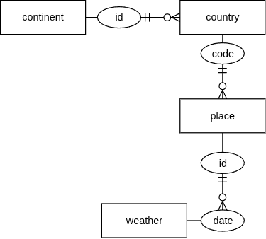
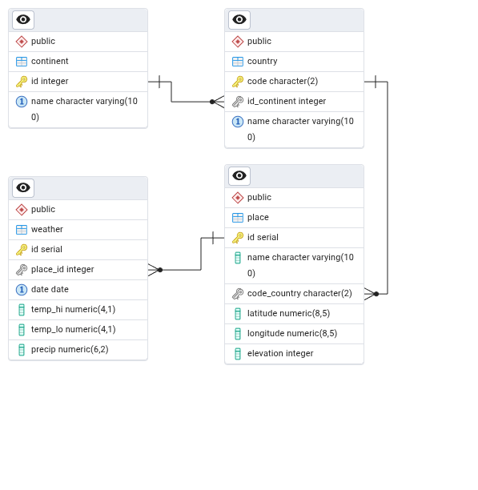

# 01 – PostgreSQL

[PostgreSQL](https://cs.wikipedia.org/wiki/PostgreSQL) (zkráceně _Postgres_) je:

- moderní, „dospělý“ databázový systém („databáze“)
- FLOSS (Free/Libre Open Source Software, „volný a otevřený“)
- cross-platform
- škálovatelný (scalable)
- jeho vývoj je podporovaný komunitou

Jméno:

- 1970s [Ingres](https://en.wikipedia.org/wiki/Ingres_%28database%29)
- 1985 ➜ POSTGRES
- 1996 ➜ PostgreSQL (změna POSTQUEL na SQL)

## Databázový systém + nástroje:

- [PostgreSQL](https://www.postgresql.org/)
- [pgAdmin](https://www.pgadmin.org/)
- [DBeaver Community Edition](https://dbeaver.io/)
- [CloudBeaver Community](https://dbeaver.com/docs/cloudbeaver/)
- jiné?

# Instalace a běh v Dockeru

Potřebujete:

- [Docker Desktop](https://www.docker.com/products/docker-desktop/)
- [docker-compose.yml](../projekt/docker-compose.yml)

Postavit a spustit multi-kontejner, v terminálu:

```bash
docker compose up # případně: --build
```

V prohlížeči:

- pgAdmin: [localhost:8001](http://localhost:8001)
- CloudBeaver: [localhost:8002](http://localhost:8002)

## Konfigurace pgAdmin:

- Login: me@me.me / me (nastaveno v docker-compose.yml)
- Object / Register / Server:
  - General/Name: ....
  - Connection/Host name: kontejner `postgres` (nikoli `localhost`)
  - Username: `dbusr`, Password: `dbpwd` (nastaveno v docker-compose.yml)

## Konfigurace CloudBeaver:

- Nastavení: Administrator Credentials
  - zvolte Login / Password
- Login:
  - zvolený Login / Password
- `[+]` / Find Database (nebo:New Connection: PostgreSQL)
  - Host: `postgres` ➜ postgres:5432
  - Authentication: `dbusr` / `dbpwd`
  - Test ➜ Create

## Provádění SQL příkazů

- pgAdmin: Tools / Query Tool
- CloudBeaver: SQL

# pgAdmin

Servers / me / Databases(2)

- postgres (výchozí systémová databáze)
- **dbusr** (vytvořená v docker-compose.yml)

```sql
SELECT version();
```

> PostgreSQL 18.0 ...

_SQL nerozlišuje velikost písmen. Tradičně se klíčová slova zapisují velkými písmeny - tradice z doby před "syntax highlighting"?_

```sql
select version(); -- funguje stejně, budu tedy psát malými písmeny
```

# [SQL](https://en.wikipedia.org/wiki/SQL) – Structured Query Language

Sublanguages:

- **DDL**: Data Definition Language (CREATE, ALTER, DROP, ...)
- **DQL**: Data Query Language (SELECT)
- **DML**: Data Manipulation Language (INSERT, UPDATE, DELETE, ...)
- **DCL**: Data Control Language (CREATE USER, GRANT, REVOKE)
- **TCL**: Transaction Control Language (BEGIN, COMMIT, ROLLBACK, ...)

## Ukázkový databázový model / práce s tabulkami (DDL, DQL, DML)

_[Postgres Ch. 2](https://www.postgresql.org/docs/current/tutorial-sql.html)_

Světadíly:

```sql
create table continent (
  id   integer      primary key,    -- PK implies "not null"
  name varchar(100) not null unique -- "not null" must be explicit here
);
-- table name: continent or continents?
```

Země:

```sql
create table country (
  code         char(2)      primary key,
  id_continent integer      references continent(id), -- Yoda: id_continent
  name         varchar(100) not null unique
);
```

Místa (města, stanice, ...):

```sql
create table place (
  id           serial       primary key,
  name         varchar(100) not null,
  code_country char(2)      references country(code),
  latitude     decimal(8,5) not null,  -- precision: ~1m
  longitude    decimal(8,5) not null,
  elevation    int                     -- meters above sea level
);

```

Denní počasí:

```sql
create table weather (  -- daily weather data
    id       serial primary key,      -- is it needed?
    id_place int    references place(id),
    date     date   not null,         -- date / date 😇

    temp_lo  decimal(4,1),            -- daily min temp (°C)
    temp_hi  decimal(4,1),            -- daily max temp (°C)
    precip   decimal(6,2),            -- precipitation (mm)

    unique(id_place, date)            -- ensure one record per day per place
);
```

## ERD - Entity-Relationship Diagram

- Tools / ERD tool
- Table / ERD for table

Volba:

1. ERD ➜ databáze, tabulky, vazby
2. Jednoduchý diagram např. v [draw.io](https://app.diagrams.net/) ➜ databáze ➜ generovaný ERD

### Metoda 2:

#### Jednoduchý ERD, roll-my-own notation (Chen + Crow's Foot):



### Generovaný ERD:



# Integrita databáze

_Referenční integrita_ zajišťuje vztahy (vazby) mezi tabulkami.

- PK `primary key`
- FK `references table(field)`

Integrita dat zajišťuje správnost dat v tabulce.

- `not null`
- `unique`
- `check (condition)`

Preferujeme „silně poutahovanou databázi“, tj. zajištění integrity na úrovni databáze, nikoli v aplikační logice.

## Jaké problémy má náš model?

# ❓

```sql
truncate table weather, place, country, continent restart identity cascade;

insert into continent (id, name) values
  (-1, 'Atlantis'),             -- negative id
  (9,  'Europe ');              -- trailing space, near-duplicate name

insert into country (code, id_continent, name) values
  ('zz', null, 'Nowhere Land'); -- lowercase code; null continent

insert into country (code, id_continent, name) values
  ('Z', 9, 'Zedland');          -- short country code

insert into country (code, id_continent, name) values
  ('ZZ', 9, 'ZedLAnd');         -- code and name differ only in case

insert into place (name, code_country, latitude, longitude, elevation) values
  ('', 'ZZ', 95.00000, -200.00000, -500);  -- empty name; wild coordinates

insert into place (name, code_country, latitude, longitude, elevation) values
  ('Záluží', 'ZZ', 0.00000, 0.00000, 10),
  ('Záluží', 'ZZ', 0.00000, 0.00000, 10);  -- duplicate name

insert into weather (id_place, date, temp_lo, temp_hi, precip) values
  (null, date '2025-01-01', 20.0, -10.0, -5.00);  -- no place, temp.hi < lo, negative precipitation

insert into weather (id_place, date, temp_lo, temp_hi, precip) values
  (null, date '2025-01-01', 49.0, 99.0,  9999.99); -- extreme weather values
```

## Upravený (poutahovaný) model

```sql
drop table if exists weather, place, country, continent;

-- validate data

create or replace function is_name(val text)
-- no leading/trailing spaces, not empty
returns boolean as $$ begin
  return val != '' and val !~ '^\s' and val !~ '\s$';
end; $$ language plpgsql;

create table continent (
  id   integer      primary key     check(0 < id),
  name varchar(100) not null unique check (is_name(name))
);

create table country (
  code         char(2)      primary key check (code ~ '^[A-Z]{2}$'),
  id_continent integer      not null references continent(id),
  name         varchar(100) not null unique check (is_name(name))
);

create table place (
  id           serial       primary key,

  code_country char(2)      references country(code),
  name         varchar(100) not null check (is_name(name)),
  unique(code_country, name),

  latitude     decimal(8,5) not null check (latitude  between  -90 and 90),
  longitude    decimal(8,5) not null check (longitude between -180 and 180),
  elevation    int          not null check (-430 <= elevation and elevation <= 8000) -- Dead Sea shore -430m
);

create table weather (
    id       serial primary key,
    id_place int    references place(id),
    date     date   not null,

    temp_lo  decimal(4,1) check (temp_lo between -90 and 90),
    temp_hi  decimal(4,1) check (temp_hi between -90 and 90),
    precip   decimal(6,2) check (precip is null or 0 <= precip and precip < 5000),

    check (temp_lo is null or temp_hi is null or temp_lo <= temp_hi),
    unique(id_place, date)
);
```

# DRY – Don't Repeat Yourself

Uživatelské datové typy (domains):

```sql
create domain d_name AS varchar(100) not null check (is_name(name));
create domain d_temp AS numeric(4,1) check (value between -90 and 90);
```

Zapoměli jsme na malá/velká písmena. V názvěch nejsou podstatná. Opravíme pomocí `citext`. Současně omezíme používání `varchar`. Postgres má nativní znakový typ [`text`](https://www.postgresql.org/docs/current/datatype-character.html).

Upravený model s použitím domén:

```sql
-- case insensitive text
create extension if not exists citext;

drop table if exists weather, place, country, continent;

-- data validation, (some) custom domains

create or replace function is_name(val text)
-- no leading/trailing spaces, not empty
returns boolean as $$ begin
  return val != '' and val !~ '^\s' and val !~ '\s$';
end; $$ language plpgsql;

drop domain if exists d_name; -- name, max. 100 chars
create domain d_name AS citext not null check (length(value) <= 100 and is_name(value));

drop domain if exists d_temp; -- temperature
create domain d_temp AS numeric(4,1) check (value between -90 and 90);

-- 8-region, continent-like world model, weather data

create table continent (
  id   integer  primary key check(0 < id),
  name d_name 	unique
);

create table country (
  code         char(2)  primary key check (code ~ '^[A-Z]{2}$'),
  id_continent integer  not null references continent(id),
  name         d_name 	unique
);

create table place (
  id           serial  primary key,

  code_country char(2) references country(code),
  name         d_name,
  unique(code_country, name),

  latitude     numeric(8,5) not null check (latitude  between  -90 and 90),
  longitude    numeric(8,5) not null check (longitude between -180 and 180),
  elevation    int          not null check (-430 <= elevation and elevation <= 8000) -- Dead Sea shore -430m
);

create table weather (
    id       serial primary key,
    id_place int    references place(id),
    date     date   not null,

    temp_lo  d_temp,
    temp_hi  d_temp,
    precip   decimal(6,2) check (precip is null or 0 <= precip and precip < 5000),

    check (temp_lo is null or temp_hi is null or temp_lo <= temp_hi),
    unique(id_place, date)
);

-- test data
insert into continent (id, name) values
  (1, 'Africa'),
  (2, 'Antarctica'),
  (3, 'Arctic'),
  (4, 'Asia'),
  (5, 'Europe'),
  (6, 'North America'),
  (7, 'South America'),
  (8, 'Oceania');

insert into country (code, id_continent, name) values
  ('ZA', 1, 'South Africa'),
  ('EG', 1, 'Egypt'),
  ('KE', 1, 'Kenya'),

  ('AQ', 2, 'Antarctica'),

  ('GL', 3, 'Greenland'),
  ('SJ', 3, 'Svalbard and Jan Mayen'),

  ('CN', 4, 'China'),
  ('IN', 4, 'India'),
  ('JP', 4, 'Japan'),
  ('SA', 4, 'Saudi Arabia'),

  ('DE', 5, 'Germany'),
  ('FR', 5, 'France'),
  ('IT', 5, 'Italy'),
  ('ES', 5, 'Spain'),
  ('CZ', 5, 'Czechia'),
  ('SK', 5, 'Slovakia'),
  ('HU', 5, 'Hungary'),
  ('SI', 5, 'Slovenia'),
  ('RS', 5, 'Serbia'),
  ('ME', 5, 'Montenegro'),
  ('IS', 5, 'Iceland'),
  ('EE', 5, 'Estonia'),
  ('LV', 5, 'Latvia'),
  ('LT', 5, 'Lithuania'),
  ('UA', 5, 'Ukraine'),
  ('BY', 5, 'Belarus'),
  ('PL', 5, 'Poland'),
  ('GB', 5, 'United Kingdom'),
  ('IE', 5, 'Ireland'),
  ('NO', 5, 'Norway'),
  ('SE', 5, 'Sweden'),
  ('FI', 5, 'Finland'),
  ('RU', 5, 'Russia'),

  ('US', 6, 'United States'),
  ('CA', 6, 'Canada'),
  ('MX', 6, 'Mexico'),

  ('BR', 7, 'Brazil'),
  ('AR', 7, 'Argentina'),
  ('CL', 7, 'Chile'),
  ('CO', 7, 'Colombia'),
  ('PE', 7, 'Peru'),

  ('AU', 8, 'Australia'),
  ('NZ', 8, 'New Zealand'),
  ('FJ', 8, 'Fiji'),
  ('PG', 8, 'Papua New Guinea');

insert into place (name, code_country, latitude, longitude, elevation) values
  ('Praha', 'CZ', 50.07554, 14.43780, 235),
  ('Brno', 'CZ', 49.19506, 16.60684, 190),
  ('Ostrava', 'CZ', 49.82092, 18.26252, 214),
  ('Plzeň', 'CZ', 49.73843, 13.37364, 310),
  ('Liberec', 'CZ', 50.76711, 15.05619, 374),
  ('Olomouc', 'CZ', 49.59378, 17.25088, 219),
  ('České Budějovice',  'CZ', 48.97473, 14.47433, 381),
  ('Hradec Králové', 'CZ', 50.20923, 15.83275, 235),
  ('Pardubice', 'CZ', 50.03431, 15.78120, 225),
  ('Ústí nad Labem', 'CZ', 50.66070, 14.03227, 218),
  ('Berlin', 'DE', 52.52000, 13.40500, 34),
  ('Paris', 'FR', 48.85661, 2.35222, 35),
  ('New York', 'US', 40.71278, -74.00597, 10),
  ('Los Angeles', 'US', 34.05223, -118.24368, 71),
  ('Toronto', 'CA', 43.65323, -79.38318, 76),
  ('Mexico City', 'MX', 19.43261, -99.13321, 2250),
  ('Tokyo', 'JP', 35.68949, 139.69171, 40),
  ('Sydney', 'AU', -33.86882, 151.20930, 58),
  ('Sao Paulo', 'BR', -23.55052, -46.63331, 760),
  ('Nairobi', 'KE', -1.29207, 36.82195, 1795),
  ('Cairo', 'EG', 30.04442, 31.23571, 23),
  ('Reykjavik', 'IS', 64.14658, -21.94264, 46),
  ('Cape Town', 'ZA', -33.92487, 18.42406, 25),
  ('Auckland', 'NZ', -36.84846, 174.76333, 79);

insert into weather (id_place, date, temp_lo, temp_hi, precip)
select p.id, w.dt, w.temp_lo, w.temp_hi, w.precip
from (
  values
    ('Praha', date '2024-01-01', -3.2, 2.5, 0.00), -- once is enough
    ('Praha', date '2024-01-02', -4.0, 1.8, 0.50),
    ('Praha', date '2024-07-15', 16.4, 28.3, 2.20),
    ('London', date '2024-01-01', 3.2, 8.1, 1.80),
    ('London', date '2024-07-15', 14.5, 22.0, 0.40),
    ('New York', date '2024-01-01', -2.3, 4.0, 3.10),
    ('New York', date '2024-07-15', 22.1, 30.5, 5.60),
    ('Tokyo', date '2024-01-01', 2.4, 10.2, 0.00),
    ('Tokyo', date '2024-07-15', 25.0, 31.8, 6.30),
    ('Sydney', date '2024-01-01', 18.2, 26.5, 1.20),
    ('Sydney', date '2024-07-15', 8.8, 17.2, 0.70),
    ('Nairobi', date '2024-01-01', 15.1, 26.8, 0.00),
    ('Reykjavik', date '2024-01-01', -4.6, 1.2, 2.50),
    ('Mexico City', date '2024-07-15', 12.9, 24.7, 8.10),
    ('Cape Town', date '2024-07-15', 8.2, 16.3, 3.70),
    ('Auckland', date '2024-01-01', 16.5, 23.0, 0.90)
) as w(name, dt, temp_lo, temp_hi, precip)
join place p on p.name = w.name;
```

<!--
TODO location points (latitude, longitude)
TODO time zones, preciptation real
TODO weather stations (elevation, coordinates, country, etc.)
TODO countries spanning multiple continents (Russia, Turkey, Egypt, Kazakhstan, Azerbaijan)
TODO indexes (e.g., on place(name), weather(id_place, date), etc.)
TODO views (e.g., avg monthly temp per place, etc.)
TODO stored procedures (e.g., add_weather_data(place_name, date, temp_hi, temp_lo, precip), etc.)
TODO import from CSV
-->
