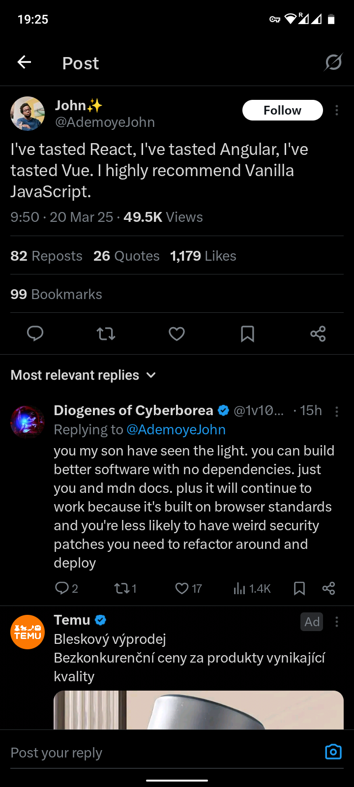
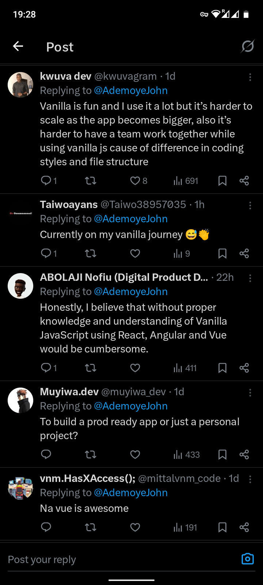
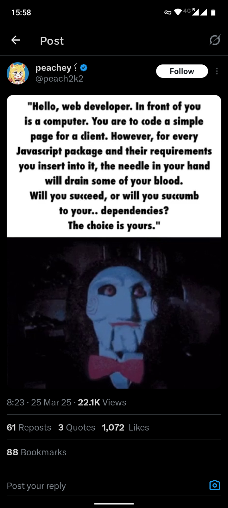
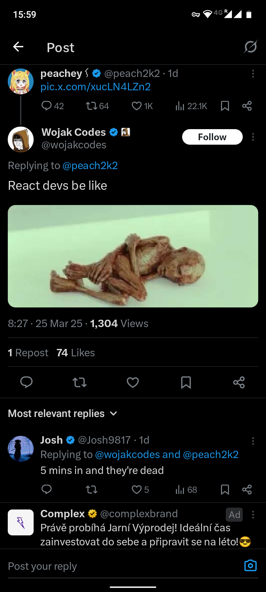

# Zápočtový projekt

Podmínkou získání zápočtu je úspěšné vypracování seminární
práce, která spočívá ve vytvoření webového projektu, v němž
budou použity probírané technologie. Student při zápočtu
předvede svůj (fungující 😉) webový projekt a je schopný jej
obhájit: student musí dobře znát svůj kód, být schopný
vysvětlit jeho funkci a případně i na místě provést malé
změny.

## Zadání:

Vytvořte _jednoduchou_ (malou obsahem, nikoli složitou, ale
čistě provedenou) full-stack webovou aplikaci, která bude
zpracovávat (ukládat, číst, filtrovat) a zobrazovat data podle
vašeho výběru.

Námět si zvolte svobodně. Mohou to být například: knihy v
knihovně, filmy v kinech, studenti ve škole, jídla v
restauraci, recepty na vaření, země na světě, piva v
pivovarech, ...

Námět si nejlépe můžete zvolit tak, aby měl souvislost s vaší
prací v jiných předmětech nebo s jinými zájmy.

Data budou uložena v databázi, případně také na disku v
souborech.

Front-end aplikace by měl být několik (3+) stránek,
provázaných navigací. Alespoň jedna stránka by měla obsahovat
HTML formulář pro vkládání dat, zadávání filtrů nebo požadavků
a tak podobně.

Na stránkách aplikace vhodným způsobem zobrazena data čtená z
databáze, z diskových souborů, apod.

**Cílem není**:

- rozsáhlý, složitý projekt

**Cílem je**:

- projekt, ve kterém si _v rozumném rozsahu_ vyzkoušíte
  příslušné technologie
- projekt, který obsahuje kód, kterému dobře rozumíte (pozor
  na AI generovaný kód, ten musíztze prostudovat, porozumět mu
  a zcela jistě vždy revidovat: zbavit jej nepotřebných částí,
  a vhodně jej upravit
- projekt, který je dobře organizovaný, přehledný, snadno
  čitelný a pochopitelný a ve kterém nejsou zbytečnosti;
  výsledku byste měli dosáhnout minimalistickými metodami
- kód, který je psaný podle zásad pragmatického programování,
  které snižuje kognitivní šum (KISS, DRY, YAGNI)

## Použité technologie:

V projektu použijete následující "vanilla" technologie:

- Server (backend): Docker/Linux/Apache:
  - Databáze: např. PostgreSQL, MySQL, MariaDB, SQLite, nebo
    jiná (také i NoSQL)
  - PHP pro dynamické generování HTML stránek, pro zpracování
    požadavků, pro čtení a zápis dat

- Klient (frontend): prohlížeč
  - HTML5, CSS, JS
  - manipulace DOM pomocí JS
  - volitelně: AJAX (fetch API)

- Další technologie: JSON, případně XML ...

**Question**: Proč vanilka?

**Answer**:

  
  
  
  

