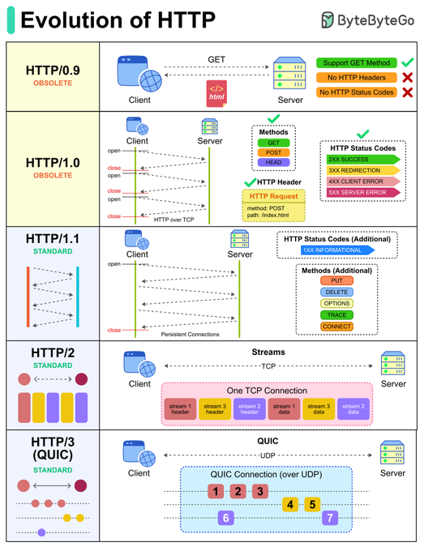

# HTTP protokol a REST API

[HTTP](https://http.dev/) (Hypertext Transfer Protocol) je
základní protokol pro komunikaci mezi klientem a serverem na
internetu.\
[MDN Web Docs: HTTP](https://developer.mozilla.org/en-US/docs/Web/HTTP)

Klient odešle HTTP požadavek, který obsahuje:

- jméno metody (akci, např. GET, POST)
- URL (adresu požadovaného zdroje)
- hlavičky (headers, metadata o požadavku)
- případně tělo požadavku (data)

Server zpracuje požadavek a vrátí HTTP odpověď, která
obsahuje:

- stavový kód (výsledek požadavku, např. 200 OK, 404 Not
  Found, ...)
- hlavičky (metadata o odpovědi)
- případně tělo odpovědi (data)

HTTP je bezstavový protokol, což znamená, že každý požadavek
je nezávislý, server neuchovává informace o předchozích
požadavcích od stejného klienta.

Pro udržení stavu (session, sezení) lze použít identifikační
data, která klient posílá s každým požadavkem, například:

- sušenky (cookies) nebo tokeny - v hlavičce
- URL parametry - v URL
- data v těle požadavku - v POST požadavcích

## Verze HTTP

- HTTP/0.9 (1991): první verze, pouze GET metoda, bez hlaviček
  a stavových kódů
  - `GET /info.html` 🠊 HTML odpověď

- HTTP/1.0 (1996): přidána identifikace verze protokolu,
  hlavičky, stavové kódy, metody HEAD a POST, MIME typy
  - `GET /info.html HTTP/1.0`\
    `Accept: text/html` 🠊 `HTTP/1.0 200 OK` ...

- HTTP/1.1 (1997): persistentní spojení, povinná hlavička
  Host:, metody PUT, DELETE, OPTIONS, TRACE, CONNECT, a další
  vylepšení. Šifrování pomocí
  [TLS](https://developer.mozilla.org/en-US/docs/Glossary/TLS)
  (HTTPS).

- HTTP/2 (2015): binární protokol, multiplexing v jednom TCP
  spojení, komprese hlaviček, ...

- HTTP/3 (2022): využívá [QUIC](https://quicwg.org/) místo
  TCP, rychlejší připojení, lepší latence ...?

\
https://x.com/sahnlam/status/2036657595436650948

## REST (restful) API

[REST](https://restfulapi.net/) - **RE**presentational
**S**tate **T**ransfer - je soubor principů pro distribuované
systémy (webové služby), který může využít HTTP protokol pro
komunikaci.\
Původ: [Roy Fielding, 2000, kap. 5](https://roy.gbiv.com/pubs/dissertation/fielding_dissertation.pdf).

### REST a HTTP nejsou to samé.

[... people wrongly relate resource methods to HTTP methods (i.e., GET/PUT/POST/DELETE)](https://restfulapi.net/)
/
[... please ... choose some other buzzword for your API.](https://roy.gbiv.com/untangled/2008/rest-apis-must-be-hypertext-driven)

Příklad **možného** použití
[HTTP jako REST API](https://www.w3schools.com/nodejs/nodejs_rest_api.asp).

## HTTP/1.1

### [Metody](https://developer.mozilla.org/en-US/docs/Web/HTTP/Reference/Methods)

Vlastnosti:

- B: Má nebo nemá tělo (data).
- R: Úspěšná odpověď (200 OK) má nebo nemá tělo (data).
- S: Je nebo není tzv. bezpečná (neovlivní stav serveru).
- I: Je nebo není idempotentní (požadavek lze opakovat bez
  změny výsledku).
- C: Je nebo není kešovatelná (výsledek lze uložit do
  mezipaměti po cestě).

| Metoda | Popis               | B   | R   | S   | I   | C     |
| ------ | ------------------- | --- | --- | --- | --- | ----- |
| GET    | získat data         | ne  | ano | ano | ano | ano   |
| HEAD   | získat GET hlavičky | ne  | ne  | ano | ano | ano   |
| POST   | odeslat data        | ano | ano | ne  | ne  | možná |

| Metoda | Popis                        | B   | R     | S   | I   | C   |
| ------ | ---------------------------- | --- | ----- | --- | --- | --- |
| PUT    | nahradit nebo vytvořit zdroj | ano | možná | ne  | ano | ne  |
| PATCH  | pozměnit zdroj               | ano | možná | ne  | ne  | ne  |
| DELETE | odstranit zdroj              | ne  | možná | ne  | ano | ne  |

| Metoda  | Popis                      | B     | R     | S   | I   | C   |
| ------- | -------------------------- | ----- | ----- | --- | --- | --- |
| OPTIONS | získat možnosti komunikace | možná | možná | ano | ano | ne  |

| Metoda  | Popis          |
| ------- | -------------- |
| TRACE   | loopback       |
| CONNECT | vytvořit tunel |

### GET a POST

Základní metody pro získávání a odesílání dat. Umí je odesílat
i HTML formuláře `<form>`. Nadále použijeme jen tyto dvě
metody.

#### GET

```http
GET /api/users?name=paul HTTP/1.1
Host: example.com
```

🠊

```http
HTTP/1.1 200 OK
Content-Type: application/json

[{"id": 1, "name": "paul", "email": "paul@example.com"}]
```

#### POST

```http
POST /api/users HTTP/1.1
Host: example.com
Content-Type: application/json

{"name": "paul"}
```

### [Stavové kódy](https://http.dev/status)

- 1xx: informační
- 2xx: úspěch (200 OK, 201 Created, ...)
- 3xx: přesměrování (301 Moved Permanently, 302 Found, 304 Not
  Modified, ...)
- 4xx: chyba klienta (400 Bad Request, 401 Unauthorized, 403
  Forbidden, 404 Not Found, ...)
- 5xx: chyba serveru (500 Internal Server Error, 502 Bad
  Gateway, 503 Service Unavailable, ...)

### [Hlavičky](https://http.dev/headers)

V požadavku a v odpovědi:

```bash
curl -v http://ujep.cz
curl -v https://ujep.cz
curl -v https://ujep.cz/cs
curl -v https://www.ujep.cz/cs
curl -vs https://www.ujep.cz/cs -o /dev/null

# ... google.com h2

```

(X-)
