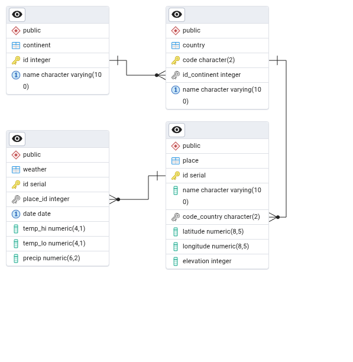

# 01 – PostgreSQL

[PostgreSQL](https://cs.wikipedia.org/wiki/PostgreSQL) (zkráceně _Postgres_) je:

- moderní, „dospělý“ databázový systém („databáze“)
- FLOSS (Free/Libre Open Source Software, „volný a otevřený“)
- cross-platform
- škálovatelný (scalable)
- jeho vývoj je podporovaný komunitou

Jméno:

- 1970s [Ingres](https://en.wikipedia.org/wiki/Ingres_%28database%29)
- 1985 ➜ POSTGRES
- 1996 ➜ PostgreSQL (změna POSTQUEL na SQL)

## Databázový systém + nástroje:

- [PostgreSQL](https://www.postgresql.org/)
- [pgAdmin](https://www.pgadmin.org/)
- [DBeaver Community Edition](https://dbeaver.io/)
- [CloudBeaver Community](https://dbeaver.com/docs/cloudbeaver/)
- jiné?

# Instalace a běh v Dockeru

Potřebujete:

- [Docker Desktop](https://www.docker.com/products/docker-desktop/)
- [docker-compose.yml](../projekt/docker-compose.yml)

Postavit a spustit multi-kontejner, v terminálu:

```bash
docker compose up # případně: --build
```

V prohlížeči:

- pgAdmin: [localhost:8001](http://localhost:8001)
- CloudBeaver: [localhost:8002](http://localhost:8002)

## Konfigurace pgAdmin:

- Login: me@me.me / me (nastaveno v docker-compose.yml)
- Object / Register / Server:
  - General/Name: ....
  - Connection/Host name: kontejner `postgres` (nikoli `localhost`)
  - Username: `dbusr`, Password: `dbpwd` (nastaveno v docker-compose.yml)

## Konfigurace CloudBeaver:

- Nastavení: Administrator Credentials
  - zvolte Login / Password
- Login:
  - zvolený Login / Password
- `[+]` / Find Database (nebo:New Connection: PostgreSQL)
  - Host: `postgres` ➜ postgres:5432
  - Authentication: `dbusr` / `dbpwd`
  - Test ➜ Create

## Provádění SQL příkazů

- pgAdmin: Tools / Query Tool
- CloudBeaver: SQL

# pgAdmin

Servers / me / Databases(2)

- postgres (výchozí systémová databáze)
- **dbusr** (vytvořená v docker-compose.yml)

```sql
SELECT version();
```

> PostgreSQL 18.0 ...

_SQL nerozlišuje velikost písmen. Tradičně se klíčová slova zapisují velkými písmeny - tradice z doby před "syntax highlighting"?_

```sql
select version(); -- funguje stejně, budu tedy psát malými písmeny
```

# [SQL](https://en.wikipedia.org/wiki/SQL) – Structured Query Language

Sublanguages:

- **DDL**: Data Definition Language (CREATE, ALTER, DROP, ...)
- **DQL**: Data Query Language (SELECT)
- **DML**: Data Manipulation Language (INSERT, UPDATE, DELETE, ...)
- **DCL**: Data Control Language (CREATE USER, GRANT, REVOKE)
- **TCL**: Transaction Control Language (BEGIN, COMMIT, ROLLBACK, ...)

## Ukázkový databázový model / práce s tabulkami (DDL, DQL, DML)

_[Postgres Ch. 2](https://www.postgresql.org/docs/current/tutorial-sql.html)_

Světadíly:

```sql
create table continent (
  id   integer      primary key,    -- PK implies "not null"
  name varchar(100) not null unique -- "not null" must be explicit here
);
-- table name: continent or continents?
```

Země:

```sql
create table country (
  code         char(2)      primary key,
  id_continent integer      references continent(id), -- Yoda: id_continent
  name         varchar(100) not null unique
);
```

Místa (města, stanice, ...):

```sql
create table place (
  id           serial       primary key,
  name         varchar(100) not null,
  code_country char(2)      references country(code),
  latitude     decimal(8,5) not null,  -- precision: ~1m
  longitude    decimal(8,5) not null,
  elevation    int                     -- meters above sea level
);

```

Denní počasí:

```sql
create table weather (  -- daily weather data
    id       serial primary key,      -- is it needed?
    id_place int    references place(id),
    date     date   not null,         -- date / date 😇

    temp_lo  decimal(4,1),            -- daily min temp (°C)
    temp_hi  decimal(4,1),            -- daily max temp (°C)
    precip   decimal(6,2),            -- precipitation (mm)

    unique(id_place, date)            -- ensure one record per day per place
);
```

## ERD - Entity-Relationship Diagram

- Tools / ERD tool
- Table / ERD for table

Volba:

1. ERD ➜ databáze, tabulky, vazby
2. Jednoduchý diagram např. v [draw.io](https://app.diagrams.net/) ➜ databáze ➜ generovaný ERD

### Metoda 2:

#### Jednoduchý ERD, roll-my-own notation (Chen + Crow's Foot):


### Generovaný ERD:



# Integrita databáze

_Referenční integrita_ zajišťuje vztahy (vazby) mezi tabulkami.

- PK `primary key`
- FK `references table(field)`

Integrita dat zajišťuje správnost dat v tabulce.

- `not null`
- `unique`
- `check (condition)`

Preferujeme „silně poutahovanou databázi“, tj. zajištění integrity na úrovni databáze, nikoli v aplikační logice.

## Jaké problémy má náš model❓

```sql
truncate table weather, place, country, continent
restart identity cascade;

-- negative id
insert into continent (id, name) values
  (-1, 'Atlantis');

-- trailing space, near-duplicate name
insert into continent (id, name) values
  (9,  'Europe ');

-- lowercase code; null continent
insert into country (code, id_continent, name) values
  ('zz', null, 'Nowhere Land');

-- short country code
insert into country (code, id_continent, name) values
  ('Z', 9, 'Zedland');

-- code and name differ only in case
insert into country (code, id_continent, name) values
  ('ZZ', 9, 'ZedLAnd');

-- empty name; wild coordinates
insert into place (name, code_country, latitude, longitude, elevation) values
  ('', 'ZZ', 95.00000, -200.00000, -500);

-- duplicate name
insert into place (name, code_country, latitude, longitude, elevation) values
  ('Záluží', 'ZZ', 0.00000, 0.00000, 10),
  ('Záluží', 'ZZ', 0.00000, 0.00000, 10);

-- no place, temp.hi < lo, negative precipitation
insert into weather (id_place, date, temp_lo, temp_hi, precip) values
  (null, date '2025-01-01', 20.0, -10.0, -5.00);

-- extreme weather values
insert into weather (id_place, date, temp_lo, temp_hi, precip) values
  (1, date '2025-01-01', -49.0, 99.0,  9999.99);
```
